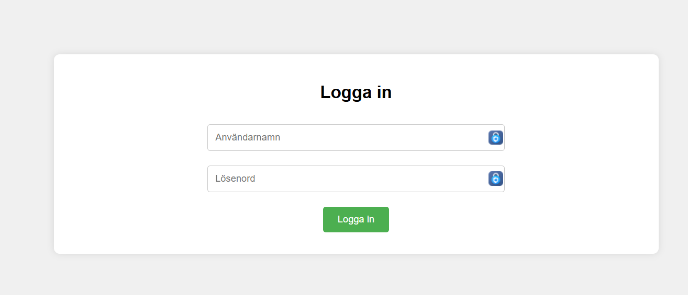
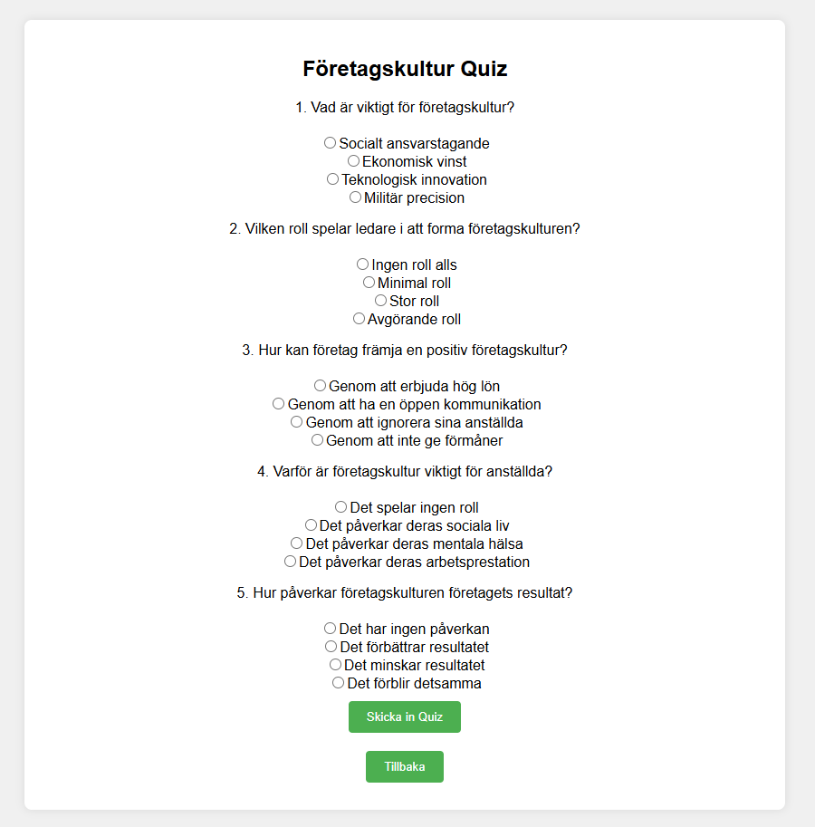
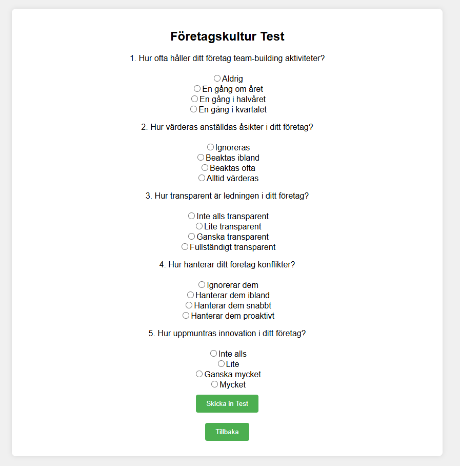
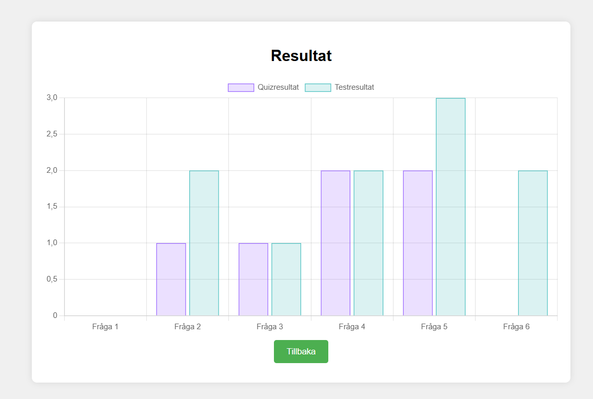
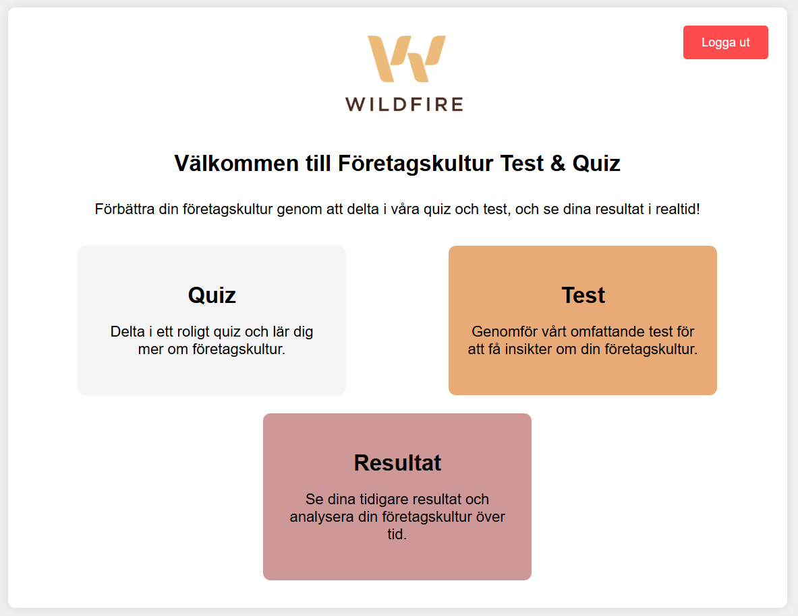

# Företagskultur Test & Quiz

Detta projekt är en webbapplikation för att förbättra företagskulturen genom att delta i quiz och tester. Resultaten kan ses i ett stapeldiagram som visar både tidigare och aktuella resultat. Applikationen är responsiv och fungerar både på webben och mobilen.

## Funktioner

### Inloggning

Användare kan logga in med ett användarnamn och lösenord för att få tillgång till applikationen. Inloggningssektionen kontrollerar användarens autentisering och visar huvudinnehållet vid lyckad inloggning.

- **Användarnamn och lösenord:** Fördefinierade värden ("user" och "password").
- **Felhantering:** Visar ett felmeddelande om användarnamn eller lösenord är felaktigt.
- **Glömt lösenord:** En länk för att återställa lösenordet (inte implementerad).

### Quiz

Användare kan delta i ett quiz med frågor relaterade till företagskultur. Detta hjälper till att förstå hur väl man känner till företagets värderingar och riktlinjer.

- **Frågor och svar:** Flera valfrågor med olika alternativ.
- **Interaktivitet:** Användare väljer svar och skickar in quizet för att få omedelbar feedback.
- **Lagring av resultat:** Quizresultat sparas lokalt för framtida referens.

### Test

Användare kan genomföra ett omfattande test för att få insikter om företagskulturen och identifiera områden som kan förbättras.

- **Djupgående frågor:** Innehåller frågor som går djupare in på företagets kultur och processer.
- **Användarvänlighet:** Enkelt att fylla i och skicka in.
- **Lagring av resultat:** Testresultat sparas lokalt för att användaren ska kunna spåra sina framsteg.

### Resultat

Användare kan se sina tidigare och aktuella resultat i ett stapeldiagram. Detta visualiserar framsteg över tid och hjälper till att identifiera trender.

- **Visualisering:** Stapeldiagram visar användarens resultat från både quiz och tester.
- **Jämförelse över tid:** Hjälper användaren att se sina framsteg och identifiera förbättringsområden.
- **Responsivitet:** Diagrammet anpassar sig efter skärmstorlek och är lättläst både på dator och mobil.

## Teknologier

### **HTML**

Används för att strukturera webbapplikationen.

### **CSS**

Används för att styla webbapplikationen och göra den responsiv.

### **JavaScript**

Används för att lägga till interaktivitet och hantera logiken.

## Användning

### 1. Logga in

Ange användarnamn och lösenord (fördefinierat till "user" och "password").

- **Användarautentisering:** Säkerställer att endast behöriga användare får tillgång till applikationen.
- **Navigering:** Vid lyckad inloggning dirigeras användaren till huvudmenyn.

### 2. Huvudmeny

Efter inloggning kommer du till huvudmenyn där du kan välja mellan Quiz, Test och Resultat.

- **Valmöjligheter:** Användaren kan enkelt navigera mellan olika sektioner av applikationen.
  

### 3. Quiz

Klicka på Quiz-boxen för att delta i quizet. Svara på frågorna och klicka på "Skicka in Quiz" för att se dina resultat.

- **Quizfrågor:** Interaktiva frågor som testar användarens kunskap om företagskultur.
- **Insamling av svar:** Svaren lagras och kan användas för att generera resultat.

### 4. Test

Klicka på Test-boxen för att genomföra testet. Svara på frågorna och klicka på "Skicka in Test" för att se dina resultat.

- **Testfrågor:** Djupgående frågor som hjälper till att analysera företagets kultur.
- **Insamling av svar:** Svaren lagras och kan användas för att generera resultat.

### 5. Resultat

Klicka på Resultat-boxen för att se ett stapeldiagram som visar dina tidigare och aktuella resultat för både quizet och testet.

- **Visualisering av data:** Resultaten visas i ett användarvänligt diagram.
- **Analys:** Hjälper användaren att identifiera förbättringsområden och spåra framsteg över tid.

## Projektstruktur

- **`index.html`:** Huvud-HTML-filen som innehåller strukturen för webbapplikationen.
- **`styles.css`:** CSS-filen som innehåller stilar för att göra applikationen responsiv och visuellt tilltalande.
- **`script.js`:** JavaScript-filen som innehåller all logik för inloggning, visning av sektioner, hantering av quiz och test.

## Filbeskrivningar

### `index.html`

Denna fil innehåller grundstrukturen för hela webbapplikationen. Den är uppdelad i flera sektioner, var och en representerar en del av applikationen (inloggning, huvudmeny, quiz, test, resultat). Varje sektion innehåller relevanta HTML-element som formulär, knappar och containers för innehåll.

### `styles.css`

Denna fil innehåller alla CSS-regler som används för att styla webbapplikationen. Den säkerställer att applikationen är responsiv och ser bra ut på olika enheter och skärmstorlekar. CSS-filen innehåller även specifika stilar för olika sektioner och komponenter, såsom knappar, formulär och diagram.

### `script.js`

Denna fil innehåller all JavaScript-logik som driver applikationen. Det inkluderar funktioner för:

- Hantering av inloggning och autentisering.
- Visning och dold av olika sektioner beroende på användarens interaktion.
- Generering och hantering av quiz- och testfrågor.
- Insamling och lagring av användarens svar.
- Visualisering av resultat med hjälp av Chart.js.
